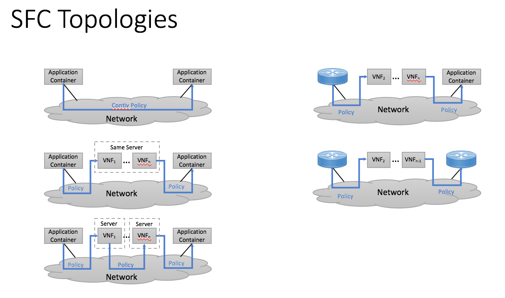

# SFC Controller

[](https://travis-ci.org/ligato/sfc-controller)
[](https://coveralls.io/github/ligato/sfc-controller?branch=master)
[](https://goreportcard.com/report/github.com/ligato/sfc-controller)
[](https://godoc.org/github.com/ligato/sfc-controller)
[](https://github.com/ligato/sfc-controller/blob/master/LICENSE)

Please note that the content of this repository is currently **WORK IN PROGRESS**.

The SFC Controller is a Golang implementation of an orchestration module
for providing data-plane connectivity for cloud native containers.  The
containers may be [Ligato VPP-agent][0] enabled containers which in turn use
[VPP][1] based cloud-native [Virtual Network Functions][2] (VNFs) or the
containers may be application containers communicating via veth interfaces.
The VPP Agent is built on top of the [CN-Infra platform][5] for developing
cloud-native Virtual Network Functions (VNFs).

The SFC Controller supports a wide variety of topologies.  The controller can
effect connectivity for containers on-host, inter-host and host to external
router.

## Architecture

The SFC Controller system architecture is shown in the following figure:


The architecture has the following components:
* **SFC Controller**: can be deployed in its own container and is responsible
for managing the data plane connectivity for a set of hosts, external 
routers and, of course, the containers.  A model of the hosts, external
routers, and chains or sets of containers is given to the SFC controller
either through a yaml config file or via REST api calls.
* **etcd**: the communication of the configuration is done via ETCD.  Each
VPP agent enabled container in the system is responsible for reading its
branch of the ETCD tree.  For non-VPP containers, the VSwitch VPP will
perform the programming of the veth interfaces.  All of the configuration
in the ETCD tree for data-plane connectivity is written to by the SFC
controller.
* **VSwitch VPP** container: there is one of these per host.  This is a special
container that the SFC Controller uses to wire the containers together,
and to wire the containers to external routers and other SFC Controller
controlled hosts.
* **VPP agent containers**: these containers are VPP enabled and have a
[Ligato VPP-agent][0] which controls the VPP in the container.  VNF's are
developed as extensions to [VPP][1].
* **non-VPP containers**: these are application containers which communicate
with other containers or externally via veth interfaces.  The VSwitch VPP
creates the veth interfaces.

## SFC Topologies

The SFC Controller supports the following topologies:



The controller is responsible for supporting connectivity between hosts, between
hosts and external routers, and between vnfs.  The traffic can be l2, or l3.
The inter vnf traffic can be intra-host, or inter-host.

```

               Topology    |vnf-vnf                         | router-vnf
                           |l2             l3               | l2    .        l3
                           |l2pp l2mp      l3pp l3mp        | l2pp l2mp      l3pp l3mp
--------------------------------------------------------------------------------------
intra-host     Direct      |
               Via Vswitch |
--------------------------------------------------------------------------------------
inter-host     Vxlan
               Srv6

```

See [here](topologies/topologies.md) for the current set of supported topologies.
See the [ContivVPP](https://github.com/contiv/vpp) for a description of its policies.

## Quickstart

For a quick start with the sfc-controller, you can use pre-built Docker images with
the Agent and VPP on [Dockerhub][6].

0. Start ETCD and Kafka on your host (e.g. in Docker as described [here][7]).
   Note: **The SFC Controller in the pre-built Docker image will not start if it can't 
   connect to Etcd**.

1. Run VPP + VPP Agent in a Docker image:
```
docker pull ligato/sfc-controller
docker run -it --name sfc-contoller --rm ligato/sfc-controller
```

## Documentation

GoDoc can be browsed [online](https://godoc.org/github.com/ligato/sfc-controller).

## Next Steps

Read the README for the [Development Docker Image](docker/dev_sfc_controller/README.md) for more details.


### Deployment:

[](docs/Deployment.md)

## Contribution:

If you are interested in contributing, please see the [contribution guidelines](CONTRIBUTING.md).

[0]: https://github.com/ligato/vpp-agent
[1]: https://fd.io/
[2]: https://github.com/ligato/cn-infra/blob/master/docs/readmes/cn_virtual_function.md
[3]: https://github.com/ligato/sfc-controller/tree/master/controller/cnpdriver
[4]: https://github.com/ligato/cn-infra
[5]: https://github.com/ligato/cn-infra/tree/master/core
[6]: https://hub.docker.com/r/ligato/sfc-controller/
[7]: docker/dev_vpp_agent/README.md#running-etcd-server-on-local-host
[8]: https://github.com/ligato/vpp-agent#quickstart
