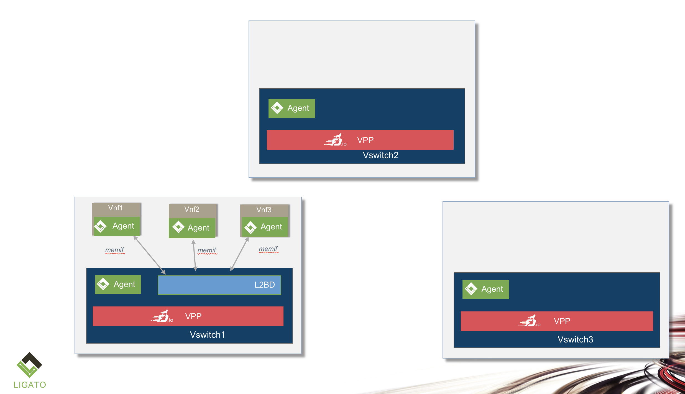
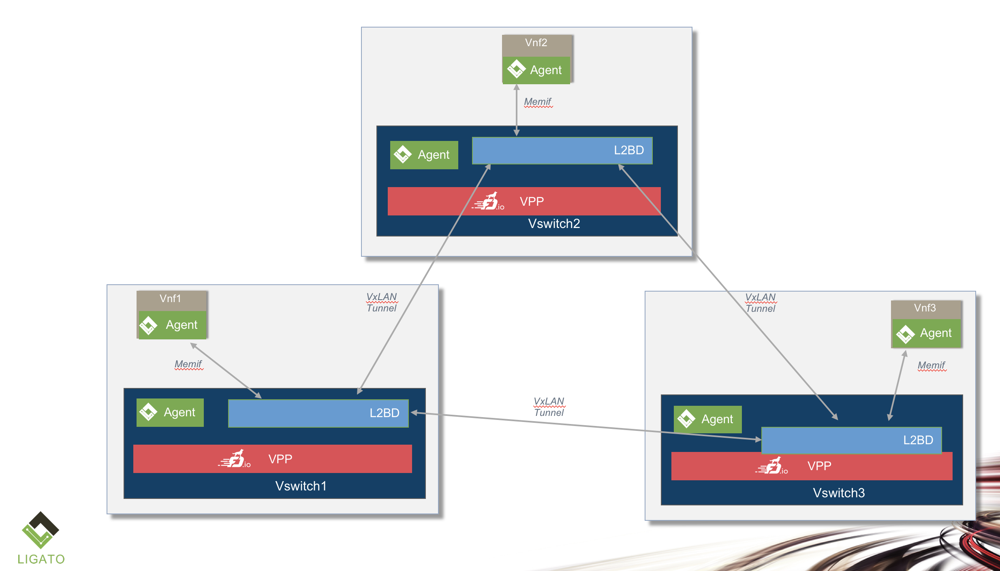
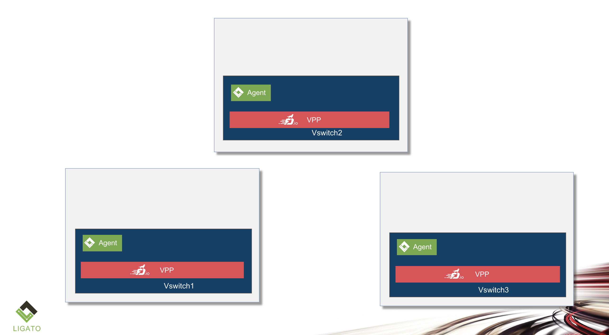

# SFC Controller VxLAN L2MP example

Please note that the content of this page is currently **WORK IN PROGRESS**.

This example describes a 3 host scenario with 3 VNF's.  A VNF L2 P2MP service
is described which bridges L2 traffic between the ports on the VNFs.
The vnf's can be hosted on any combination of the hosts.  If the vnf's are
hosted on the same host, then the ports are members of a node system
bridge or a created-on-the-fly bridge depending on the yaml.  However, if
the vnf's are host on differnt hosts, then the bridges are connected via
a mesh of vxlan tunnels.  Note: that an L2MP vnf-service requires bridges
vs the L2PP where ports can be L2 cross-connected.

This scenario illustrates how the sfc-controller adapts the service based on
changes in the topology.  Currently, to change the vnf-to-host mapping, an
HTTP REST request is used.  Kubernetes will also be able to effect changes
to this mapping once vnf's are scheduled by K8S.  The controller listens to
changes to K8S and adapts the L2 service to the topolgy changes.

1) Start the controller with a yaml file where the vnf's are on the same host.
2) Send an HTTP POST changing where the vnf's are mapped, one vnf per host.
3) Send an HTTP POST changing where the vnf's are mapped, vnf's not on a host.  

## VNF's on Same Host



1. Start up the controller with a yaml file (vnf's on same host)

```
sfc-controller -sfc-config=toplogies/vxlanmesh/l2mp/vxlanlmpp.yaml -clean
```

The yaml file looks like:
```

    sfc_controller_config_version: 2
    description: 3 node with 1 nic port, host-host vxlan mesh, vnf on each node
    
    system_parameters:
      memif_directory: "/run/vpp" # a common folder where all vnf's and vswitches are mounted

    ipam_pools:  # allocate internode vxlan mesh enpoints from a pool
      - metadata:
          name: vxlan_tunnel_pool
          labels:
        spec:
          scope: system
          network: 111.111.111.0/24
          start_range: 1
          end_range: 3

    network_pod_to_node_map:
      - pod: vnf1
        node: vswitch1
      - pod: vnf2
        node: vswitch1
      - pod: vnf3
        node: vswitch1
        
    network_nodes:
      - metadata:
          name: vswitch1
        spec:
          node_type: host
          interfaces:
            - name: GigabitEthernet0/8/1
              if_type: ethernet
              ip_addresses:
                - "10.100.1.1/24"
              labels:
                - vxlan # outgoing i/f for static route from the vxlan loopback address to remote vxlan dest(s)
      - metadata:
          name: vswitch2
        spec:
          node_type: host
          interfaces:
            - name: GigabitEthernet0/8/2
              if_type: ethernet
              ip_addresses:
                - "10.100.2.2/24"
              labels:
                - vxlan # outgoing i/f for static route from the vxlan loopback address to remote vxlan dest(s)

      - metadata:
          name: vswitch3
        spec:
          node_type: host
          interfaces:
            - name: GigabitEthernet0/8/3
              if_type: ethernet
              ip_addresses:
                - "10.100.3.3/24"
              labels:
                - vxlan # outgoing i/f for static route from the vxlan loopback address to remote vxlan dest(s)

    network_services:
      - metadata:
          name: my-network-service
        spec:
          network_pods:
            - metadata:
                name: vnf1
              spec:
                pod_type: vppcontainer
                interfaces:
                  - name: port1
                    if_type: memif
                    memif_parms:
                    ip_addresses:
                      - "111.111.111.1/24"
            - metadata:
                name: vnf2
              spec:
                pod_type: vppcontainer
                interfaces:
                  - name: port1
                    if_type: memif
                    memif_parms:
                    ip_addresses:
                      - "111.111.111.2/24"
            - metadata:
                name: vnf3
              spec:
                pod_type: vppcontainer
                interfaces:
                  - name: port1
                    if_type: memif
                    memif_parms:
                    ip_addresses:
                      - "111.111.111.2/24"                      
          connections:
            - conn_type: l2mp
              conn_method: vswitch
              network_node_overlay_name: inter_node_vxlan_mesh
              pod_interfaces:
                - vnf1/port1
                - vnf2/port1
                - vnf3/port1

    network_node_overlays:
      - metadata:
          name:
            inter_node_vxlan_mesh
        spec:
          service_mesh_type: mesh
          connection_type: vxlan
          vxlan_mesh_parms:
            vni_range_start: 5000
            vni_range_end: 5999
            loopback_ipam_pool_name: vxlan_tunnel_pool
            create_loopback_interface: true
            create_loopback_static_routes: true


```

The sfc-controller creates an l2 bridge on the host: vswitch1, and adds the vswitch side
of the memif interfaces for each of the vnf ports defined in the network service.

## VNF's on Three Different Hosts



1. Send an HTTP POST curl command to the controller

```
curl -X POST -d @- << EOF http://0.0.0.0:9191/sfc-controller/v2/config/network_pod_to_node_map
[
  {
    "pod": "vnf1",
    "node": "vswitch1"
  },
  {
    "pod": "vnf2",
    "node": "vswitch2"
  },
  {
    "pod": "vnf3",
    "node": "vswitch3"
  }
]
EOF
```

The sfc-controller creates an l2 bridge on each host where a vnf is hosted.  Because the
network service spans hosts, the network node overlay defined in the network service is
used to generate a vxlan tunnel mesh to/from each host.  Note that these tunnels are
created only if a host "hosts" a vnf.  Conversely, if a vnf "moves" to a new host and the
old host no longer hosts a vnf, then the vxlan tunnel is removed.


## VNF's not on any hosts



1. Send an HTTP POST curl command to the controller

```

curl -X POST -d @- << EOF http://0.0.0.0:9191/sfc-controller/v2/config/network_pod_to_node_map
[
  {
    "pod": "vnf1"
  },
  {
    "pod": "vnf2"
  },
  {
    "pod": "vnf3"
  }
]
EOF

```

The sfc-controller cleans up the configuration in etcd, as it does not know where the vnf's
are hosted.


[0]: https://github.com/ligato/vpp-agent
[1]: https://fd.io/
[2]: https://github.com/ligato/cn-infra/blob/master/docs/readmes/cn_virtual_function.md
[3]: https://github.com/ligato/sfc-controller/tree/master/controller/cnpdriver
[4]: https://github.com/ligato/cn-infra
[5]: https://github.com/ligato/cn-infra/tree/master/core
[6]: https://hub.docker.com/r/ligato/sfc-controller/
[7]: docker/dev_vpp_agent/README.md#running-etcd-server-on-local-host
[8]: https://github.com/ligato/vpp-agent#quickstart