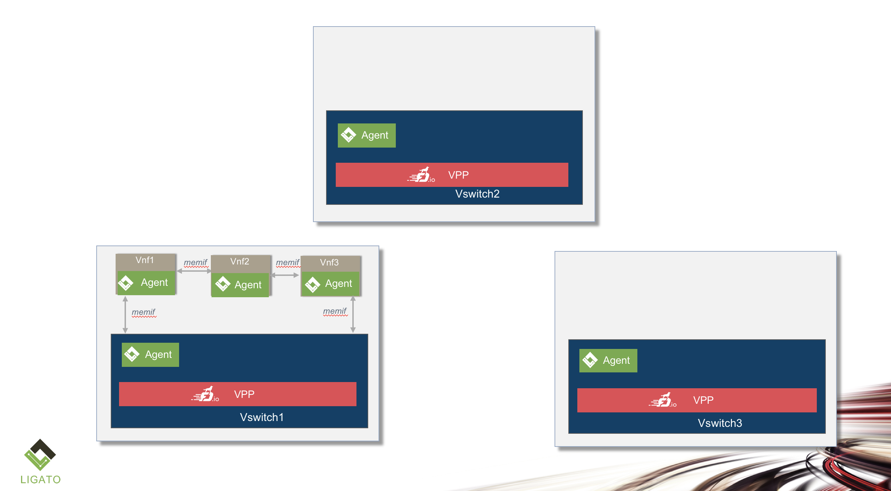
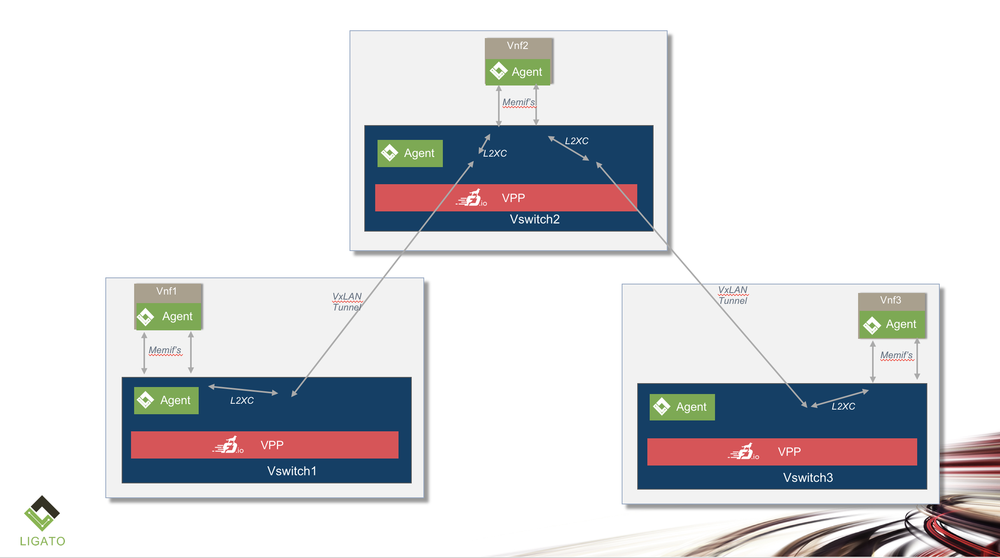

# SFC Controller VxLAN L2PP example

Please note that the content of this page is currently **WORK IN PROGRESS**.

This example describes a 3 host scenario with 3 VNF's.  A VNF L2 P2P service
is described which chains ports from vnf1, to vnf2 to vnf3.  The vnf's can
be hosted on any combination of the hosts.  If the vnf's are hosted on the
same host, then the chain can be rendered with direct memif links between
the hosts.  Otherwise, the inter-vnf connections require a vxlan tunnel.
Note that the L2PP vnf service uses L2 cross-connected to chain the ports
together vs an L2MP vnf service would require a bridging solution as the
inter-vnf traffic can go from any nf port to any other vnf port in the connection
set.

This scenario illustrates how the sfc-controller adapts the service based on
changes in the topology.  Currently, to change the vnf-to-host mapping, an
HTTP REST request is used.  Kubernetes will also be able to effect changes
to this mapping once vnf's are scheduled by K8S.  The controller listens to
changes to K8S and adapts the L2 service to the topolgy changes.

1) Start the controller with a yaml file where the vnf's are on the same host.
2) Send an HTTP POST changing where the vnf's are mapped, one vnf per host.
3) Send an HTTP POST changing where the vnf's are mapped, vnf's not on a host.  

## VNF's on Same Host



1. Start up the controller with a yaml file (vnf's on same host)

```
sfc-controller -sfc-config=toplogies/vxlanmesh/l2pp/vxlanl2pp.yaml -clean
```

The yaml file looks like:
```
sfc_controller_config_version: 2
description: 3 nodes with 1 nic port, host-host vxlan mesh, vnf on each node

system_parameters:
  ipam_pools:
    - name: vxlan_loopback_pool
      network: 111.111.111.0/24

vnf_to_node_map:
  - vnf: vnf1
    node: vswitch1
  - vnf: vnf2
    node: vswitch1
  - vnf: vnf3
    node: vswitch1

nodes:
  - name: vswitch1
    node_type: host
    interfaces:
      - name: gigethernet13/1/1
        if_type: ethernet
        ip_addresses:
          - "10.100.1.1/16"
        custom_labels:
          - vxlan
      - name: gigethernet13/1/2
        if_type: ethernet
        ip_addresses:
          - "10.100.1.2/16"
        custom_labels:
          - vxlan

  - name: vswitch2
    node_type: host
    interfaces:
      - name: gigethernet13/2/1
        if_type: ethernet
        ip_addresses:
          - "10.100.2.1/16"
      - name: gigethernet13/2/2
        if_type: ethernet
        ip_addresses:
          - "10.100.2.2/16"
        custom_labels:
          - vxlan

  - name: vswitch3
    node_type: host
    interfaces:
      - name: gigethernet13/3/1
        if_type: ethernet
        ip_addresses:
          - "10.100.3.1/16"
       
vnf_services:
  - name: service1
    vnfs:
      - name: vnf1
        vnf_type: vppcontainer
        interfaces:
          - name: port1
            if_type: memif
          - name: port2
            if_type: memif
        forwarding:
          - type: l2xc
            l2xc_interfaces:
                - port1
                - port2   
      - name: vnf2
        node: vswitch2
        vnf_type: vppcontainer
        interfaces:
          - name: port1
            if_type: memif
          - name: port2
            if_type: memif
        forwarding:
          - type: l2xc
            l2xc_interfaces:
                - port1
                - port2   
      - name: vnf3
        node: vswitch3
        vnf_type: vppcontainer
        interfaces:
          - name: port1
            if_type: memif
          - name: port2
            if_type: memif
        forwarding:
          - type: l2xc
            l2xc_interfaces:
                - port1
                - port2
    connections:
      - conn_type: l2pp
        vnf_service_mesh: inter_host_vxlan_mesh
        interfaces:
          - vnf: vnf1
            interface: port2
          - vnf: vnf2
            interface: port1
      - conn_type: l2pp
        vnf_service_mesh: inter_host_vxlan_mesh
        interfaces:
          - vnf: vnf2
            interface: port2
          - vnf: vnf3
            interface: port1

vnf_service_meshs:
  - name: inter_host_vxlan_mesh
    service_mesh_type: mesh
    connection_type: vxlan
    vxlan_mesh_parms:
      vni_range_start: 5000
      vni_range_end: 5999
      loopback_ipam_pool_name: vxlan_loopback_pool
      outgoing_interface_label: vxlan


```

The vpp agent keys, and values are as follows::

```
curl http://0.0.0.0:9191/sfc-controller/v2/status/vpp-entries
[
  {
    "VppKey": "/vnf-agent/vnf1/vpp/config/v1/interface/port2",
    "VppEntryType": "interface",
    "IFace": {
      "name": "port2",
      "type": 2,
      "mtu": 1500,
      "memif": {
        "id": 1,
        "socket_filename": "/tmp/memif_vnf2.sock"
      }
    },
    "L2BD": null,
    "L3Route": null,
    "XConn": null,
    "LinuxIFace": null
  },
  {
    "VppKey": "/vnf-agent/vnf3/vpp/config/v1/interface/port1",
    "VppEntryType": "interface",
    "IFace": {
      "name": "port1",
      "type": 2,
      "mtu": 1500,
      "memif": {
        "master": true,
        "id": 2,
        "socket_filename": "/tmp/memif_vnf3.sock"
      }
    },
    "L2BD": null,
    "L3Route": null,
    "XConn": null,
    "LinuxIFace": null
  },
  {
    "VppKey": "/vnf-agent/vswitch2/vpp/config/v1/interface/gigethernet13/2/1",
    "VppEntryType": "interface",
    "IFace": {
      "name": "gigethernet13/2/1",
      "type": 1,
      "mtu": 1500,
      "ip_addresses": [
        "10.100.2.1/16"
      ]
    },
    "L2BD": null,
    "L3Route": null,
    "XConn": null,
    "LinuxIFace": null
  },
  {
    "VppKey": "/vnf-agent/vnf2/vpp/config/v1/interface/port2",
    "VppEntryType": "interface",
    "IFace": {
      "name": "port2",
      "type": 2,
      "mtu": 1500,
      "memif": {
        "id": 2,
        "socket_filename": "/tmp/memif_vnf3.sock"
      }
    },
    "L2BD": null,
    "L3Route": null,
    "XConn": null,
    "LinuxIFace": null
  },
  {
    "VppKey": "/vnf-agent/vswitch1/vpp/config/v1/interface/gigethernet13/1/2",
    "VppEntryType": "interface",
    "IFace": {
      "name": "gigethernet13/1/2",
      "type": 1,
      "mtu": 1500,
      "ip_addresses": [
        "10.100.1.2/16"
      ]
    },
    "L2BD": null,
    "L3Route": null,
    "XConn": null,
    "LinuxIFace": null
  },
  {
    "VppKey": "/vnf-agent/vnf2/vpp/config/v1/interface/port1",
    "VppEntryType": "interface",
    "IFace": {
      "name": "port1",
      "type": 2,
      "mtu": 1500,
      "memif": {
        "master": true,
        "id": 1,
        "socket_filename": "/tmp/memif_vnf2.sock"
      }
    },
    "L2BD": null,
    "L3Route": null,
    "XConn": null,
    "LinuxIFace": null
  },
  {
    "VppKey": "/vnf-agent/vswitch2/vpp/config/v1/interface/gigethernet13/2/2",
    "VppEntryType": "interface",
    "IFace": {
      "name": "gigethernet13/2/2",
      "type": 1,
      "mtu": 1500,
      "ip_addresses": [
        "10.100.2.2/16"
      ]
    },
    "L2BD": null,
    "L3Route": null,
    "XConn": null,
    "LinuxIFace": null
  },
  {
    "VppKey": "/vnf-agent/vswitch3/vpp/config/v1/interface/gigethernet13/3/1",
    "VppEntryType": "interface",
    "IFace": {
      "name": "gigethernet13/3/1",
      "type": 1,
      "mtu": 1500,
      "ip_addresses": [
        "10.100.3.1/16"
      ]
    },
    "L2BD": null,
    "L3Route": null,
    "XConn": null,
    "LinuxIFace": null
  },
  {
    "VppKey": "/vnf-agent/vswitch1/vpp/config/v1/interface/gigethernet13/1/1",
    "VppEntryType": "interface",
    "IFace": {
      "name": "gigethernet13/1/1",
      "type": 1,
      "mtu": 1500,
      "ip_addresses": [
        "10.100.1.1/16"
      ]
    },
    "L2BD": null,
    "L3Route": null,
    "XConn": null,
    "LinuxIFace": null
  }
]

```

The etcd /sfc-controller subtree look like:

```

/sfc-controller/v2/config/vnf-service-mesh/inter_host_vxlan_mesh
{"name":"inter_host_vxlan_mesh","service_mesh_type":"mesh","connection_type":"vxlan","vxlan_mesh_parms":{"vni_range_start":5000,"vni_range_end":5999,"loopback_ipam_pool_name":"vxlan_loopback_pool","outgoing_interface_label":"vxlan"}}
/sfc-controller/v2/config/node/vswitch1
{"name":"vswitch1","node_type":"host","interfaces":[{"name":"gigethernet13/1/1","if_type":"ethernet","ip_addresses":["10.100.1.1/16"],"custom_labels":["vxlan"]},{"name":"gigethernet13/1/2","if_type":"ethernet","ip_addresses":["10.100.1.2/16"],"custom_labels":["vxlan"]}]}
/sfc-controller/v2/config/node/vswitch2
{"name":"vswitch2","node_type":"host","interfaces":[{"name":"gigethernet13/2/1","if_type":"ethernet","ip_addresses":["10.100.2.1/16"]},{"name":"gigethernet13/2/2","if_type":"ethernet","ip_addresses":["10.100.2.2/16"],"custom_labels":["vxlan"]}]}
/sfc-controller/v2/config/node/vswitch3
{"name":"vswitch3","node_type":"host","interfaces":[{"name":"gigethernet13/3/1","if_type":"ethernet","ip_addresses":["10.100.3.1/16"]}]}
/sfc-controller/v2/config/system-parameters
{"mtu":1500,"default_static_route_preference":5,"ipam_pools":[{"name":"vxlan_loopback_pool","network":"111.111.111.0/24"}]}
/sfc-controller/v2/config/vnf-service/service1
{"name":"service1","vnfs":[{"name":"vnf1","vnf_type":"vppcontainer","interfaces":[{"name":"port1","if_type":"memif"},{"name":"port2","if_type":"memif"}]},{"name":"vnf2","vnf_type":"vppcontainer","interfaces":[{"name":"port1","if_type":"memif"},{"name":"port2","if_type":"memif"}]},{"name":"vnf3","vnf_type":"vppcontainer","interfaces":[{"name":"port1","if_type":"memif"},{"name":"port2","if_type":"memif"}]}],"connections":[{"conn_type":"l2pp","vnf_service_mesh":"inter_host_vxlan_mesh","interfaces":[{"vnf":"vnf1","interface":"port2"},{"vnf":"vnf2","interface":"port1"}]},{"conn_type":"l2pp","vnf_service_mesh":"inter_host_vxlan_mesh","interfaces":[{"vnf":"vnf2","interface":"port2"},{"vnf":"vnf3","interface":"port1"}]}]}
/sfc-controller/v2/config/vnf-to-node/vnf1
{"vnf":"vnf1","node":"vswitch1"}
/sfc-controller/v2/config/vnf-to-node/vnf2
{"vnf":"vnf2","node":"vswitch1"}
/sfc-controller/v2/config/vnf-to-node/vnf3
{"vnf":"vnf3","node":"vswitch1"}
/sfc-controller/v2/status/node/vswitch1
{"name":"vswitch1","oper_status":"OperUp","msg":["OK"],"rendered_vpp_agent_entries":[{"vpp_agent_key":"/vnf-agent/vswitch1/vpp/config/v1/interface/gigethernet13/1/1","vpp_agent_type":"interface"},{"vpp_agent_key":"/vnf-agent/vswitch1/vpp/config/v1/interface/gigethernet13/1/2","vpp_agent_type":"interface"}]}
/sfc-controller/v2/status/node/vswitch2
{"name":"vswitch2","oper_status":"OperUp","msg":["OK"],"rendered_vpp_agent_entries":[{"vpp_agent_key":"/vnf-agent/vswitch2/vpp/config/v1/interface/gigethernet13/2/1","vpp_agent_type":"interface"},{"vpp_agent_key":"/vnf-agent/vswitch2/vpp/config/v1/interface/gigethernet13/2/2","vpp_agent_type":"interface"}]}
/sfc-controller/v2/status/node/vswitch3
{"name":"vswitch3","oper_status":"OperUp","msg":["OK"],"rendered_vpp_agent_entries":[{"vpp_agent_key":"/vnf-agent/vswitch3/vpp/config/v1/interface/gigethernet13/3/1","vpp_agent_type":"interface"}]}
/sfc-controller/v2/status/vnf-service/service1
{"name":"service1","oper_status":"OperUp","msg":["OK"],"rendered_vpp_agent_entries":[{"vpp_agent_key":"/vnf-agent/vnf1/vpp/config/v1/interface/port2","vpp_agent_type":"interface"},{"vpp_agent_key":"/vnf-agent/vnf2/vpp/config/v1/interface/port1","vpp_agent_type":"interface"},{"vpp_agent_key":"/vnf-agent/vnf2/vpp/config/v1/interface/port2","vpp_agent_type":"interface"},{"vpp_agent_key":"/vnf-agent/vnf3/vpp/config/v1/interface/port1","vpp_agent_type":"interface"}]}


```

## VNF's on Three Different Hosts



1. Send an HTTP POST curl command to the controller

```
curl -X POST -d @- << EOF http://0.0.0.0:9191/sfc-controller/v2/config/vnf-to-node-map
[
  {
    "vnf": "vnf1",
    "node": "vswitch1"
  },
  {
    "vnf": "vnf2",
    "node": "vswitch2"
  },
  {
    "vnf": "vnf3",
    "node": "vswitch3"
  }
]
EOF
```

The vpp agent keys, and values are as follows::

```

curl http://0.0.0.0:9191/sfc-controller/v2/status/vpp-entries
[
  {
    "VppKey": "/vnf-agent/vswitch1/vpp/config/v1/interface/IF_MEMIF_VSWITCH_vnf1_port2",
    "VppEntryType": "interface",
    "IFace": {
      "name": "IF_MEMIF_VSWITCH_vnf1_port2",
      "type": 2,
      "mtu": 1500,
      "memif": {
        "master": true,
        "id": 9,
        "socket_filename": "/tmp/memif_vswitch1.sock"
      }
    },
    "L2BD": null,
    "L3Route": null,
    "XConn": null,
    "LinuxIFace": null
  },
  {
    "VppKey": "/vnf-agent/vswitch1/vpp/config/v1/interface/IF_VXLAN_vswitch1_vswitch2_CONN_0_VNI_5002",
    "VppEntryType": "interface",
    "IFace": {
      "name": "IF_VXLAN_vswitch1_vswitch2_CONN_0_VNI_5002",
      "type": 5,
      "vxlan": {
        "src_address": "111.111.111.1",
        "dst_address": "111.111.111.2",
        "vni": 5002
      }
    },
    "L2BD": null,
    "L3Route": null,
    "XConn": null,
    "LinuxIFace": null
  },
  {
    "VppKey": "/vnf-agent/vswitch2/vpp/config/v1/vrf/0/fib/111.111.111.0/24/10.100.1.1",
    "VppEntryType": "l3vrf",
    "IFace": null,
    "L2BD": null,
    "L3Route": {
      "description": "L3VRF_VXLAN Node:vswitch2 to Node:vswitch1",
      "dst_ip_addr": "111.111.111.1/24",
      "next_hop_addr": "10.100.1.1",
      "outgoing_interface": "gigethernet13/2/2",
      "preference": 5
    },
    "XConn": null,
    "LinuxIFace": null
  },
  {
    "VppKey": "/vnf-agent/vswitch1/vpp/config/v1/interface/gigethernet13/1/1",
    "VppEntryType": "interface",
    "IFace": {
      "name": "gigethernet13/1/1",
      "type": 1,
      "mtu": 1500,
      "ip_addresses": [
        "10.100.1.1/16"
      ]
    },
    "L2BD": null,
    "L3Route": null,
    "XConn": null,
    "LinuxIFace": null
  },
  {
    "VppKey": "/vnf-agent/vswitch2/vpp/config/v1/interface/gigethernet13/2/1",
    "VppEntryType": "interface",
    "IFace": {
      "name": "gigethernet13/2/1",
      "type": 1,
      "mtu": 1500,
      "ip_addresses": [
        "10.100.2.1/16"
      ]
    },
    "L2BD": null,
    "L3Route": null,
    "XConn": null,
    "LinuxIFace": null
  },
  {
    "VppKey": "/vnf-agent/vswitch3/vpp/config/v1/interface/gigethernet13/3/1",
    "VppEntryType": "interface",
    "IFace": {
      "name": "gigethernet13/3/1",
      "type": 1,
      "mtu": 1500,
      "ip_addresses": [
        "10.100.3.1/16"
      ]
    },
    "L2BD": null,
    "L3Route": null,
    "XConn": null,
    "LinuxIFace": null
  },
  {
    "VppKey": "/vnf-agent/vnf2/vpp/config/v1/interface/port2",
    "VppEntryType": "interface",
    "IFace": {
      "name": "port2",
      "type": 2,
      "mtu": 1500,
      "memif": {
        "id": 11,
        "socket_filename": "/tmp/memif_vswitch2.sock"
      }
    },
    "L2BD": null,
    "L3Route": null,
    "XConn": null,
    "LinuxIFace": null
  },
  {
    "VppKey": "/vnf-agent/vswitch3/vpp/config/v1/xconnect/IF_VXLAN_vswitch3_vswitch2_CONN_1_VNI_5003",
    "VppEntryType": "l2xc",
    "IFace": null,
    "L2BD": null,
    "L3Route": null,
    "XConn": {
      "receive_interface": "IF_VXLAN_vswitch3_vswitch2_CONN_1_VNI_5003",
      "transmit_interface": "IF_MEMIF_VSWITCH_vnf3_port1"
    },
    "LinuxIFace": null
  },
  {
    "VppKey": "/vnf-agent/vswitch2/vpp/config/v1/interface/IF_MEMIF_VSWITCH_vnf2_port1",
    "VppEntryType": "interface",
    "IFace": {
      "name": "IF_MEMIF_VSWITCH_vnf2_port1",
      "type": 2,
      "mtu": 1500,
      "memif": {
        "master": true,
        "id": 10,
        "socket_filename": "/tmp/memif_vswitch2.sock"
      }
    },
    "L2BD": null,
    "L3Route": null,
    "XConn": null,
    "LinuxIFace": null
  },
  {
    "VppKey": "/vnf-agent/vswitch1/vpp/config/v1/interface/gigethernet13/1/2",
    "VppEntryType": "interface",
    "IFace": {
      "name": "gigethernet13/1/2",
      "type": 1,
      "mtu": 1500,
      "ip_addresses": [
        "10.100.1.2/16"
      ]
    },
    "L2BD": null,
    "L3Route": null,
    "XConn": null,
    "LinuxIFace": null
  },
  {
    "VppKey": "/vnf-agent/vswitch2/vpp/config/v1/vrf/0/fib/111.111.111.0/24/10.100.1.2",
    "VppEntryType": "l3vrf",
    "IFace": null,
    "L2BD": null,
    "L3Route": {
      "description": "L3VRF_VXLAN Node:vswitch2 to Node:vswitch1",
      "dst_ip_addr": "111.111.111.1/24",
      "next_hop_addr": "10.100.1.2",
      "outgoing_interface": "gigethernet13/2/2",
      "preference": 5
    },
    "XConn": null,
    "LinuxIFace": null
  },
  {
    "VppKey": "/vnf-agent/vnf3/vpp/config/v1/interface/port1",
    "VppEntryType": "interface",
    "IFace": {
      "name": "port1",
      "type": 2,
      "mtu": 1500,
      "memif": {
        "id": 12,
        "socket_filename": "/tmp/memif_vswitch3.sock"
      }
    },
    "L2BD": null,
    "L3Route": null,
    "XConn": null,
    "LinuxIFace": null
  },
  {
    "VppKey": "/vnf-agent/vswitch3/vpp/config/v1/interface/IF_VXLAN_vswitch3_vswitch2_CONN_1_VNI_5003",
    "VppEntryType": "interface",
    "IFace": {
      "name": "IF_VXLAN_vswitch3_vswitch2_CONN_1_VNI_5003",
      "type": 5,
      "vxlan": {
        "src_address": "111.111.111.3",
        "dst_address": "111.111.111.2",
        "vni": 5003
      }
    },
    "L2BD": null,
    "L3Route": null,
    "XConn": null,
    "LinuxIFace": null
  },
  {
    "VppKey": "/vnf-agent/vswitch2/vpp/config/v1/interface/IF_MEMIF_VSWITCH_vnf2_port2",
    "VppEntryType": "interface",
    "IFace": {
      "name": "IF_MEMIF_VSWITCH_vnf2_port2",
      "type": 2,
      "mtu": 1500,
      "memif": {
        "master": true,
        "id": 11,
        "socket_filename": "/tmp/memif_vswitch2.sock"
      }
    },
    "L2BD": null,
    "L3Route": null,
    "XConn": null,
    "LinuxIFace": null
  },
  {
    "VppKey": "/vnf-agent/vswitch3/vpp/config/v1/vrf/0/fib/111.111.111.0/24/10.100.2.2",
    "VppEntryType": "l3vrf",
    "IFace": null,
    "L2BD": null,
    "L3Route": {
      "description": "L3VRF_VXLAN Node:vswitch3 to Node:vswitch2",
      "dst_ip_addr": "111.111.111.2/24",
      "next_hop_addr": "10.100.2.2",
      "outgoing_interface": "gigethernet13/3/1",
      "preference": 5
    },
    "XConn": null,
    "LinuxIFace": null
  },
  {
    "VppKey": "/vnf-agent/vnf2/vpp/config/v1/interface/port1",
    "VppEntryType": "interface",
    "IFace": {
      "name": "port1",
      "type": 2,
      "mtu": 1500,
      "memif": {
        "id": 10,
        "socket_filename": "/tmp/memif_vswitch2.sock"
      }
    },
    "L2BD": null,
    "L3Route": null,
    "XConn": null,
    "LinuxIFace": null
  },
  {
    "VppKey": "/vnf-agent/vswitch3/vpp/config/v1/xconnect/IF_MEMIF_VSWITCH_vnf3_port1",
    "VppEntryType": "l2xc",
    "IFace": null,
    "L2BD": null,
    "L3Route": null,
    "XConn": {
      "receive_interface": "IF_MEMIF_VSWITCH_vnf3_port1",
      "transmit_interface": "IF_VXLAN_vswitch3_vswitch2_CONN_1_VNI_5003"
    },
    "LinuxIFace": null
  },
  {
    "VppKey": "/vnf-agent/vswitch2/vpp/config/v1/interface/IF_VXLAN_vswitch2_vswitch1_CONN_0_VNI_5002",
    "VppEntryType": "interface",
    "IFace": {
      "name": "IF_VXLAN_vswitch2_vswitch1_CONN_0_VNI_5002",
      "type": 5,
      "vxlan": {
        "src_address": "111.111.111.2",
        "dst_address": "111.111.111.1",
        "vni": 5002
      }
    },
    "L2BD": null,
    "L3Route": null,
    "XConn": null,
    "LinuxIFace": null
  },
  {
    "VppKey": "/vnf-agent/vswitch2/vpp/config/v1/xconnect/IF_MEMIF_VSWITCH_vnf2_port1",
    "VppEntryType": "l2xc",
    "IFace": null,
    "L2BD": null,
    "L3Route": null,
    "XConn": {
      "receive_interface": "IF_MEMIF_VSWITCH_vnf2_port1",
      "transmit_interface": "IF_VXLAN_vswitch2_vswitch1_CONN_0_VNI_5002"
    },
    "LinuxIFace": null
  },
  {
    "VppKey": "/vnf-agent/vswitch2/vpp/config/v1/interface/IF_VXLAN_vswitch2_vswitch3_CONN_1_VNI_5003",
    "VppEntryType": "interface",
    "IFace": {
      "name": "IF_VXLAN_vswitch2_vswitch3_CONN_1_VNI_5003",
      "type": 5,
      "vxlan": {
        "src_address": "111.111.111.2",
        "dst_address": "111.111.111.3",
        "vni": 5003
      }
    },
    "L2BD": null,
    "L3Route": null,
    "XConn": null,
    "LinuxIFace": null
  },
  {
    "VppKey": "/vnf-agent/vswitch1/vpp/config/v1/interface/IF_VXLAN_LOOPBACK_vswitch1",
    "VppEntryType": "interface",
    "IFace": {
      "name": "IF_VXLAN_LOOPBACK_vswitch1",
      "enabled": true,
      "mtu": 1500,
      "ip_addresses": [
        "111.111.111.1/24"
      ]
    },
    "L2BD": null,
    "L3Route": null,
    "XConn": null,
    "LinuxIFace": null
  },
  {
    "VppKey": "/vnf-agent/vswitch2/vpp/config/v1/vrf/0/fib/111.111.111.0/24/10.100.3.1",
    "VppEntryType": "l3vrf",
    "IFace": null,
    "L2BD": null,
    "L3Route": {
      "description": "L3VRF_VXLAN Node:vswitch2 to Node:vswitch3",
      "dst_ip_addr": "111.111.111.3/24",
      "next_hop_addr": "10.100.3.1",
      "outgoing_interface": "gigethernet13/2/2",
      "preference": 5
    },
    "XConn": null,
    "LinuxIFace": null
  },
  {
    "VppKey": "/vnf-agent/vswitch2/vpp/config/v1/interface/IF_VXLAN_LOOPBACK_vswitch2",
    "VppEntryType": "interface",
    "IFace": {
      "name": "IF_VXLAN_LOOPBACK_vswitch2",
      "enabled": true,
      "mtu": 1500,
      "ip_addresses": [
        "111.111.111.2/24"
      ]
    },
    "L2BD": null,
    "L3Route": null,
    "XConn": null,
    "LinuxIFace": null
  },
  {
    "VppKey": "/vnf-agent/vswitch1/vpp/config/v1/xconnect/IF_MEMIF_VSWITCH_vnf1_port2",
    "VppEntryType": "l2xc",
    "IFace": null,
    "L2BD": null,
    "L3Route": null,
    "XConn": {
      "receive_interface": "IF_MEMIF_VSWITCH_vnf1_port2",
      "transmit_interface": "IF_VXLAN_vswitch1_vswitch2_CONN_0_VNI_5002"
    },
    "LinuxIFace": null
  },
  {
    "VppKey": "/vnf-agent/vswitch2/vpp/config/v1/xconnect/IF_VXLAN_vswitch2_vswitch1_CONN_0_VNI_5002",
    "VppEntryType": "l2xc",
    "IFace": null,
    "L2BD": null,
    "L3Route": null,
    "XConn": {
      "receive_interface": "IF_VXLAN_vswitch2_vswitch1_CONN_0_VNI_5002",
      "transmit_interface": "IF_MEMIF_VSWITCH_vnf2_port1"
    },
    "LinuxIFace": null
  },
  {
    "VppKey": "/vnf-agent/vswitch2/vpp/config/v1/interface/gigethernet13/2/2",
    "VppEntryType": "interface",
    "IFace": {
      "name": "gigethernet13/2/2",
      "type": 1,
      "mtu": 1500,
      "ip_addresses": [
        "10.100.2.2/16"
      ]
    },
    "L2BD": null,
    "L3Route": null,
    "XConn": null,
    "LinuxIFace": null
  },
  {
    "VppKey": "/vnf-agent/vswitch1/vpp/config/v1/vrf/0/fib/111.111.111.0/24/10.100.2.2",
    "VppEntryType": "l3vrf",
    "IFace": null,
    "L2BD": null,
    "L3Route": {
      "description": "L3VRF_VXLAN Node:vswitch1 to Node:vswitch2",
      "dst_ip_addr": "111.111.111.2/24",
      "next_hop_addr": "10.100.2.2",
      "outgoing_interface": "gigethernet13/1/2",
      "preference": 5
    },
    "XConn": null,
    "LinuxIFace": null
  },
  {
    "VppKey": "/vnf-agent/vswitch3/vpp/config/v1/interface/IF_MEMIF_VSWITCH_vnf3_port1",
    "VppEntryType": "interface",
    "IFace": {
      "name": "IF_MEMIF_VSWITCH_vnf3_port1",
      "type": 2,
      "mtu": 1500,
      "memif": {
        "master": true,
        "id": 12,
        "socket_filename": "/tmp/memif_vswitch3.sock"
      }
    },
    "L2BD": null,
    "L3Route": null,
    "XConn": null,
    "LinuxIFace": null
  },
  {
    "VppKey": "/vnf-agent/vnf1/vpp/config/v1/interface/port2",
    "VppEntryType": "interface",
    "IFace": {
      "name": "port2",
      "type": 2,
      "mtu": 1500,
      "memif": {
        "id": 9,
        "socket_filename": "/tmp/memif_vswitch1.sock"
      }
    },
    "L2BD": null,
    "L3Route": null,
    "XConn": null,
    "LinuxIFace": null
  },
  {
    "VppKey": "/vnf-agent/vswitch2/vpp/config/v1/xconnect/IF_MEMIF_VSWITCH_vnf2_port2",
    "VppEntryType": "l2xc",
    "IFace": null,
    "L2BD": null,
    "L3Route": null,
    "XConn": {
      "receive_interface": "IF_MEMIF_VSWITCH_vnf2_port2",
      "transmit_interface": "IF_VXLAN_vswitch2_vswitch3_CONN_1_VNI_5003"
    },
    "LinuxIFace": null
  },
  {
    "VppKey": "/vnf-agent/vswitch2/vpp/config/v1/xconnect/IF_VXLAN_vswitch2_vswitch3_CONN_1_VNI_5003",
    "VppEntryType": "l2xc",
    "IFace": null,
    "L2BD": null,
    "L3Route": null,
    "XConn": {
      "receive_interface": "IF_VXLAN_vswitch2_vswitch3_CONN_1_VNI_5003",
      "transmit_interface": "IF_MEMIF_VSWITCH_vnf2_port2"
    },
    "LinuxIFace": null
  },
  {
    "VppKey": "/vnf-agent/vswitch1/vpp/config/v1/xconnect/IF_VXLAN_vswitch1_vswitch2_CONN_0_VNI_5002",
    "VppEntryType": "l2xc",
    "IFace": null,
    "L2BD": null,
    "L3Route": null,
    "XConn": {
      "receive_interface": "IF_VXLAN_vswitch1_vswitch2_CONN_0_VNI_5002",
      "transmit_interface": "IF_MEMIF_VSWITCH_vnf1_port2"
    },
    "LinuxIFace": null
  },
  {
    "VppKey": "/vnf-agent/vswitch3/vpp/config/v1/interface/IF_VXLAN_LOOPBACK_vswitch3",
    "VppEntryType": "interface",
    "IFace": {
      "name": "IF_VXLAN_LOOPBACK_vswitch3",
      "enabled": true,
      "mtu": 1500,
      "ip_addresses": [
        "111.111.111.3/24"
      ]
    },
    "L2BD": null,
    "L3Route": null,
    "XConn": null,
    "LinuxIFace": null
  }
]


```

The etcd /sfc-controller subtree look like:

```

/sfc-controller/v2/config/vnf-service-mesh/inter_host_vxlan_mesh
{"name":"inter_host_vxlan_mesh","service_mesh_type":"mesh","connection_type":"vxlan","vxlan_mesh_parms":{"vni_range_start":5000,"vni_range_end":5999,"loopback_ipam_pool_name":"vxlan_loopback_pool","outgoing_interface_label":"vxlan"}}
/sfc-controller/v2/config/node/vswitch1
{"name":"vswitch1","node_type":"host","interfaces":[{"name":"gigethernet13/1/1","if_type":"ethernet","ip_addresses":["10.100.1.1/16"],"custom_labels":["vxlan"]},{"name":"gigethernet13/1/2","if_type":"ethernet","ip_addresses":["10.100.1.2/16"],"custom_labels":["vxlan"]}]}
/sfc-controller/v2/config/node/vswitch2
{"name":"vswitch2","node_type":"host","interfaces":[{"name":"gigethernet13/2/1","if_type":"ethernet","ip_addresses":["10.100.2.1/16"]},{"name":"gigethernet13/2/2","if_type":"ethernet","ip_addresses":["10.100.2.2/16"],"custom_labels":["vxlan"]}]}
/sfc-controller/v2/config/node/vswitch3
{"name":"vswitch3","node_type":"host","interfaces":[{"name":"gigethernet13/3/1","if_type":"ethernet","ip_addresses":["10.100.3.1/16"]}]}
/sfc-controller/v2/config/system-parameters
{"mtu":1500,"default_static_route_preference":5,"ipam_pools":[{"name":"vxlan_loopback_pool","network":"111.111.111.0/24"}]}
/sfc-controller/v2/config/vnf-service/service1
{"name":"service1","vnfs":[{"name":"vnf1","vnf_type":"vppcontainer","interfaces":[{"name":"port1","if_type":"memif"},{"name":"port2","if_type":"memif"}]},{"name":"vnf2","vnf_type":"vppcontainer","interfaces":[{"name":"port1","if_type":"memif"},{"name":"port2","if_type":"memif"}]},{"name":"vnf3","vnf_type":"vppcontainer","interfaces":[{"name":"port1","if_type":"memif"},{"name":"port2","if_type":"memif"}]}],"connections":[{"conn_type":"l2pp","vnf_service_mesh":"inter_host_vxlan_mesh","interfaces":[{"vnf":"vnf1","interface":"port2"},{"vnf":"vnf2","interface":"port1"}]},{"conn_type":"l2pp","vnf_service_mesh":"inter_host_vxlan_mesh","interfaces":[{"vnf":"vnf2","interface":"port2"},{"vnf":"vnf3","interface":"port1"}]}]}
/sfc-controller/v2/config/vnf-to-node/vnf1
{"vnf":"vnf1","node":"vswitch1"}
/sfc-controller/v2/config/vnf-to-node/vnf2
{"vnf":"vnf2","node":"vswitch2"}
/sfc-controller/v2/config/vnf-to-node/vnf3
{"vnf":"vnf3","node":"vswitch3"}
/sfc-controller/v2/status/node/vswitch1
{"name":"vswitch1","oper_status":"OperUp","msg":["OK"],"rendered_vpp_agent_entries":[{"vpp_agent_key":"/vnf-agent/vswitch1/vpp/config/v1/interface/gigethernet13/1/1","vpp_agent_type":"interface"},{"vpp_agent_key":"/vnf-agent/vswitch1/vpp/config/v1/interface/gigethernet13/1/2","vpp_agent_type":"interface"}]}
/sfc-controller/v2/status/node/vswitch2
{"name":"vswitch2","oper_status":"OperUp","msg":["OK"],"rendered_vpp_agent_entries":[{"vpp_agent_key":"/vnf-agent/vswitch2/vpp/config/v1/interface/gigethernet13/2/1","vpp_agent_type":"interface"},{"vpp_agent_key":"/vnf-agent/vswitch2/vpp/config/v1/interface/gigethernet13/2/2","vpp_agent_type":"interface"}]}
/sfc-controller/v2/status/node/vswitch3
{"name":"vswitch3","oper_status":"OperUp","msg":["OK"],"rendered_vpp_agent_entries":[{"vpp_agent_key":"/vnf-agent/vswitch3/vpp/config/v1/interface/gigethernet13/3/1","vpp_agent_type":"interface"}]}
/sfc-controller/v2/status/vnf-service/service1
{"name":"service1","oper_status":"OperUp","msg":["OK"],"rendered_vpp_agent_entries":[{"vpp_agent_key":"/vnf-agent/vnf1/vpp/config/v1/interface/port2","vpp_agent_type":"interface"},{"vpp_agent_key":"/vnf-agent/vswitch1/vpp/config/v1/interface/IF_MEMIF_VSWITCH_vnf1_port2","vpp_agent_type":"interface"},{"vpp_agent_key":"/vnf-agent/vnf2/vpp/config/v1/interface/port1","vpp_agent_type":"interface"},{"vpp_agent_key":"/vnf-agent/vswitch2/vpp/config/v1/interface/IF_MEMIF_VSWITCH_vnf2_port1","vpp_agent_type":"interface"},{"vpp_agent_key":"/vnf-agent/vswitch1/vpp/config/v1/interface/IF_VXLAN_vswitch1_vswitch2_CONN_0_VNI_5000","vpp_agent_type":"interface"},{"vpp_agent_key":"/vnf-agent/vswitch2/vpp/config/v1/interface/IF_VXLAN_vswitch2_vswitch1_CONN_0_VNI_5000","vpp_agent_type":"interface"},{"vpp_agent_key":"/vnf-agent/vswitch1/vpp/config/v1/xconnect/IF_MEMIF_VSWITCH_vnf1_port2","vpp_agent_type":"l2xc"},{"vpp_agent_key":"/vnf-agent/vswitch1/vpp/config/v1/xconnect/IF_VXLAN_vswitch1_vswitch2_CONN_0_VNI_5000","vpp_agent_type":"l2xc"},{"vpp_agent_key":"/vnf-agent/vswitch2/vpp/config/v1/xconnect/IF_MEMIF_VSWITCH_vnf2_port1","vpp_agent_type":"l2xc"},{"vpp_agent_key":"/vnf-agent/vswitch2/vpp/config/v1/xconnect/IF_VXLAN_vswitch2_vswitch1_CONN_0_VNI_5000","vpp_agent_type":"l2xc"},{"vpp_agent_key":"/vnf-agent/vnf2/vpp/config/v1/interface/port2","vpp_agent_type":"interface"},{"vpp_agent_key":"/vnf-agent/vswitch2/vpp/config/v1/interface/IF_MEMIF_VSWITCH_vnf2_port2","vpp_agent_type":"interface"},{"vpp_agent_key":"/vnf-agent/vnf3/vpp/config/v1/interface/port1","vpp_agent_type":"interface"},{"vpp_agent_key":"/vnf-agent/vswitch3/vpp/config/v1/interface/IF_MEMIF_VSWITCH_vnf3_port1","vpp_agent_type":"interface"},{"vpp_agent_key":"/vnf-agent/vswitch2/vpp/config/v1/interface/IF_VXLAN_vswitch2_vswitch3_CONN_1_VNI_5001","vpp_agent_type":"interface"},{"vpp_agent_key":"/vnf-agent/vswitch3/vpp/config/v1/interface/IF_VXLAN_vswitch3_vswitch2_CONN_1_VNI_5001","vpp_agent_type":"interface"},{"vpp_agent_key":"/vnf-agent/vswitch2/vpp/config/v1/xconnect/IF_MEMIF_VSWITCH_vnf2_port2","vpp_agent_type":"l2xc"},{"vpp_agent_key":"/vnf-agent/vswitch2/vpp/config/v1/xconnect/IF_VXLAN_vswitch2_vswitch3_CONN_1_VNI_5001","vpp_agent_type":"l2xc"},{"vpp_agent_key":"/vnf-agent/vswitch3/vpp/config/v1/xconnect/IF_MEMIF_VSWITCH_vnf3_port1","vpp_agent_type":"l2xc"},{"vpp_agent_key":"/vnf-agent/vswitch3/vpp/config/v1/xconnect/IF_VXLAN_vswitch3_vswitch2_CONN_1_VNI_5001","vpp_agent_type":"l2xc"}]}


```

## VNF's not on any hosts


1. Send an HTTP POST curl command to the controller

```

curl -X POST -d @- << EOF http://0.0.0.0:9191/sfc-controller/v2/config/vnf-to-node-map
[
  {
    "vnf": "vnf1"
  },
  {
    "vnf": "vnf2"
  },
  {
    "vnf": "vnf3"
  }
]
EOF

```

The vpp agent keys, and values are as follows::

```

curl http://0.0.0.0:9191/sfc-controller/v2/status/vpp-entries
[
  {
    "VppKey": "/vnf-agent/vswitch1/vpp/config/v1/interface/gigethernet13/1/1",
    "VppEntryType": "interface",
    "IFace": {
      "name": "gigethernet13/1/1",
      "type": 1,
      "mtu": 1500,
      "ip_addresses": [
        "10.100.1.1/16"
      ]
    },
    "L2BD": null,
    "L3Route": null,
    "XConn": null,
    "LinuxIFace": null
  },
  {
    "VppKey": "/vnf-agent/vswitch2/vpp/config/v1/interface/gigethernet13/2/2",
    "VppEntryType": "interface",
    "IFace": {
      "name": "gigethernet13/2/2",
      "type": 1,
      "mtu": 1500,
      "ip_addresses": [
        "10.100.2.2/16"
      ]
    },
    "L2BD": null,
    "L3Route": null,
    "XConn": null,
    "LinuxIFace": null
  },
  {
    "VppKey": "/vnf-agent/vswitch3/vpp/config/v1/interface/gigethernet13/3/1",
    "VppEntryType": "interface",
    "IFace": {
      "name": "gigethernet13/3/1",
      "type": 1,
      "mtu": 1500,
      "ip_addresses": [
        "10.100.3.1/16"
      ]
    },
    "L2BD": null,
    "L3Route": null,
    "XConn": null,
    "LinuxIFace": null
  },
  {
    "VppKey": "/vnf-agent/vswitch2/vpp/config/v1/interface/gigethernet13/2/1",
    "VppEntryType": "interface",
    "IFace": {
      "name": "gigethernet13/2/1",
      "type": 1,
      "mtu": 1500,
      "ip_addresses": [
        "10.100.2.1/16"
      ]
    },
    "L2BD": null,
    "L3Route": null,
    "XConn": null,
    "LinuxIFace": null
  },
  {
    "VppKey": "/vnf-agent/vswitch1/vpp/config/v1/interface/gigethernet13/1/2",
    "VppEntryType": "interface",
    "IFace": {
      "name": "gigethernet13/1/2",
      "type": 1,
      "mtu": 1500,
      "ip_addresses": [
        "10.100.1.2/16"
      ]
    },
    "L2BD": null,
    "L3Route": null,
    "XConn": null,
    "LinuxIFace": null
  }
]


```

The etcd /sfc-controller subtree look like:

```

/sfc-controller/v2/config/vnf-service-mesh/inter_host_vxlan_mesh
{"name":"inter_host_vxlan_mesh","service_mesh_type":"mesh","connection_type":"vxlan","vxlan_mesh_parms":{"vni_range_start":5000,"vni_range_end":5999,"loopback_ipam_pool_name":"vxlan_loopback_pool","outgoing_interface_label":"vxlan"}}
/sfc-controller/v2/config/node/vswitch1
{"name":"vswitch1","node_type":"host","interfaces":[{"name":"gigethernet13/1/1","if_type":"ethernet","ip_addresses":["10.100.1.1/16"],"custom_labels":["vxlan"]},{"name":"gigethernet13/1/2","if_type":"ethernet","ip_addresses":["10.100.1.2/16"],"custom_labels":["vxlan"]}]}
/sfc-controller/v2/config/node/vswitch2
{"name":"vswitch2","node_type":"host","interfaces":[{"name":"gigethernet13/2/1","if_type":"ethernet","ip_addresses":["10.100.2.1/16"]},{"name":"gigethernet13/2/2","if_type":"ethernet","ip_addresses":["10.100.2.2/16"],"custom_labels":["vxlan"]}]}
/sfc-controller/v2/config/node/vswitch3
{"name":"vswitch3","node_type":"host","interfaces":[{"name":"gigethernet13/3/1","if_type":"ethernet","ip_addresses":["10.100.3.1/16"]}]}
/sfc-controller/v2/config/system-parameters
{"mtu":1500,"default_static_route_preference":5,"ipam_pools":[{"name":"vxlan_loopback_pool","network":"111.111.111.0/24"}]}
/sfc-controller/v2/config/vnf-service/service1
{"name":"service1","vnfs":[{"name":"vnf1","vnf_type":"vppcontainer","interfaces":[{"name":"port1","if_type":"memif"},{"name":"port2","if_type":"memif"}]},{"name":"vnf2","vnf_type":"vppcontainer","interfaces":[{"name":"port1","if_type":"memif"},{"name":"port2","if_type":"memif"}]},{"name":"vnf3","vnf_type":"vppcontainer","interfaces":[{"name":"port1","if_type":"memif"},{"name":"port2","if_type":"memif"}]}],"connections":[{"conn_type":"l2pp","vnf_service_mesh":"inter_host_vxlan_mesh","interfaces":[{"vnf":"vnf1","interface":"port2"},{"vnf":"vnf2","interface":"port1"}]},{"conn_type":"l2pp","vnf_service_mesh":"inter_host_vxlan_mesh","interfaces":[{"vnf":"vnf2","interface":"port2"},{"vnf":"vnf3","interface":"port1"}]}]}
/sfc-controller/v2/config/vnf-to-node/vnf1
{"vnf":"vnf1"}
/sfc-controller/v2/config/vnf-to-node/vnf2
{"vnf":"vnf2"}
/sfc-controller/v2/config/vnf-to-node/vnf3
{"vnf":"vnf3"}
/sfc-controller/v2/status/node/vswitch1
{"name":"vswitch1","oper_status":"OperUp","msg":["OK"],"rendered_vpp_agent_entries":[{"vpp_agent_key":"/vnf-agent/vswitch1/vpp/config/v1/interface/gigethernet13/1/1","vpp_agent_type":"interface"},{"vpp_agent_key":"/vnf-agent/vswitch1/vpp/config/v1/interface/gigethernet13/1/2","vpp_agent_type":"interface"}]}
/sfc-controller/v2/status/node/vswitch2
{"name":"vswitch2","oper_status":"OperUp","msg":["OK"],"rendered_vpp_agent_entries":[{"vpp_agent_key":"/vnf-agent/vswitch2/vpp/config/v1/interface/gigethernet13/2/1","vpp_agent_type":"interface"},{"vpp_agent_key":"/vnf-agent/vswitch2/vpp/config/v1/interface/gigethernet13/2/2","vpp_agent_type":"interface"}]}
/sfc-controller/v2/status/node/vswitch3
{"name":"vswitch3","oper_status":"OperUp","msg":["OK"],"rendered_vpp_agent_entries":[{"vpp_agent_key":"/vnf-agent/vswitch3/vpp/config/v1/interface/gigethernet13/3/1","vpp_agent_type":"interface"}]}
/sfc-controller/v2/status/vnf-service/service1
{"name":"service1","oper_status":"OperDown","msg":["connection segment: vnf1/port2, vnf not associated with a host","connection segment: vnf1/port2, vnf references non existant host: ","connection segment: vnf2/port1, vnf not associated with a host","connection segment: vnf2/port1, vnf references non existant host: ","connection segment: vnf2/port2, vnf not associated with a host","connection segment: vnf2/port2, vnf references non existant host: ","connection segment: vnf3/port1, vnf not associated with a host","connection segment: vnf3/port1, vnf references non existant host: "]}


```


[0]: https://github.com/ligato/vpp-agent
[1]: https://fd.io/
[2]: https://github.com/ligato/cn-infra/blob/master/docs/readmes/cn_virtual_function.md
[3]: https://github.com/ligato/sfc-controller/tree/master/controller/cnpdriver
[4]: https://github.com/ligato/cn-infra
[5]: https://github.com/ligato/cn-infra/tree/master/core
[6]: https://hub.docker.com/r/ligato/sfc-controller/
[7]: docker/dev_vpp_agent/README.md#running-etcd-server-on-local-host
[8]: https://github.com/ligato/vpp-agent#quickstart